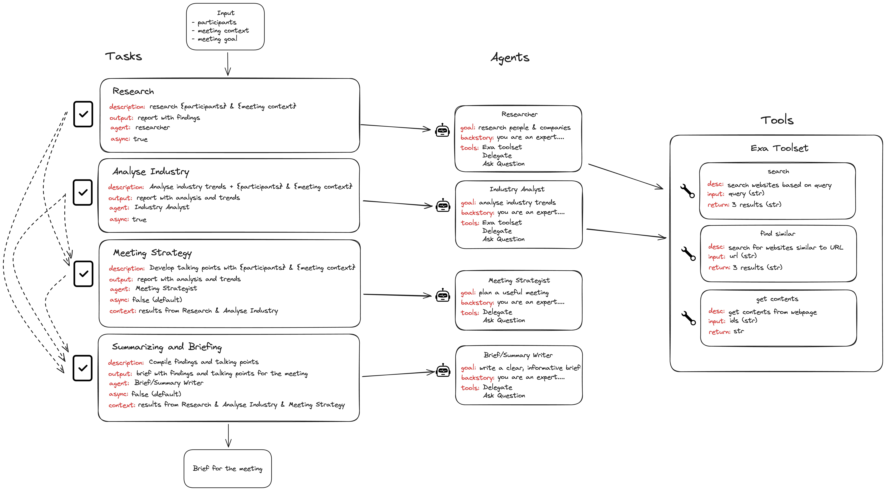

# Drug Bioactivity Prediction with Machine Learning

## Project Overview
Our project is focused on enhancing the drug design process by utilizing machine learning (ML) techniques to predict the bioactivity of chemical compounds against target proteins. By accurately predicting the potential efficacy of compounds early in the design phase, we aim to significantly reduce both the time and financial costs associated with drug development. This approach allows researchers to identify and eliminate potential failure points, ultimately improving the overall success rates in drug discovery.


## Objectives

1. **Reduce drug discovery timelines** by automating the design process with machine learning.
2. **Minimize financial costs** involved in initial research.
3. **Identify and eliminate potential failure points** at early stages, improving the success rate of drug candidates.


## Workflow

Our workflow consists of several key phases that guide our project from data collection to deployment:

1. **Data Collection**: We begin by gathering comprehensive data on FDA-approved drugs. This data serves as the backbone of our analysis and model training, ensuring that we work with reliable and relevant information.

2. **Data Preprocessing**: Once we have collected the data, the next step involves cleaning and preparing it for analysis. This stage is crucial as it ensures the accuracy and quality of the dataset we will use in subsequent phases.

3. **Exploratory Data Analysis (EDA)**: We conduct a thorough analysis and visualization of the data to uncover patterns and identify key features that may influence drug bioactivity. This step helps us better understand the dataset and informs our model-building decisions.

4. **Molecular Descriptor Calculation**: To enrich our dataset, we compute molecular descriptors, which are numerical representations of molecular structure. These descriptors enhance our models' ability to predict bioactivity by providing critical chemical information.

5. **Dataset Preparation**: After calculating the molecular descriptors, we organize the dataset to facilitate efficient training and testing of our models. This preparation ensures that our data is structured in a way that optimizes model performance.

6. **Model Building**: With the prepared dataset, we train multiple machine learning models. We focus on optimizing hyperparameters to enhance the performance of each model, ensuring that we explore a variety of algorithms to find the best fit for our prediction task.

7. **Model Comparison**: After training, we compare the performance of the different models to identify the one that delivers the most accurate predictions. This comparison is essential for selecting the best model to move forward with.

8. **Deployment**: Once we have identified the best-performing model, we deploy it as a Streamlit web application. This user-friendly interface allows researchers, professors, academicians, and students in pharmaceuticals and medicine to access our predictions easily.

9. **Integration with LLM Chatbot**: To further enhance the research experience, we incorporate an AI-powered chatbot using [OnDemand.io](https://www.ondemand.io). This chatbot automates initial research steps for R&D professionals, providing real-time assistance and streamlining workflows.

[Google Colab Files for Evaluation](https://github.com/ramik0115/Colab_Notebooks_brAInwave_TeamH14)

## Team Members and Roles

1. **Jayani Sehgal**

- Led the Data Collection process, gathering comprehensive datasets on FDA-approved drugs from reliable sources.
- Ensured data quality by performing Data Preprocessing, cleaning, and formatting data for consistency and accuracy.
- Supported exploratory analysis by preparing initial summaries of key dataset features.

2. **Dev Maurya**

- Conducted Exploratory Data Analysis (EDA) to identify important patterns and trends within the data, providing insights into potential factors influencing drug bioactivity.
- Worked closely with Member 1 to visualize data, utilizing advanced plotting techniques for a deeper understanding of the dataset.
- Helped in deciding relevant features to consider during Model Building.

3. **Ramik Tiwari**

- Focused on Molecular Descriptor Calculation, creating numerical representations of each drug molecule to enrich the dataset with valuable chemical information.
- Took charge of Dataset Preparation to ensure efficient training and testing, handling the structuring and formatting of data to maximize model performance.
- Developed, tuned, and optimized several Machine Learning Models, experimenting with different algorithms and hyperparameters to enhance predictive accuracy.

4. **Prabhat Mishra**

- Led the Model Comparison stage, rigorously evaluating the performance of different models to identify the most accurate predictor.
- Handled Deployment by building a user-friendly Streamlit web application that allows end-users to access drug bioactivity predictions.
- Integrated an LLM Chatbot using OnDemand.io, automating initial research steps to assist R&D professionals, thus providing seamless access to relevant research insights.

## OnDemand AI Agent Overview



## Getting Started

### Prerequisites
- Python 3.x
- [Streamlit](https://streamlit.io/)
- [OnDemand.io API Key](https://ondemand.io/)
- Other necessary libraries as listed in `requirements.txt`
- 


### Installation
To set up the project locally, clone the repository and install the required packages:

1. Clone the Repository
2. Set Up a Virtual Environment
Create a virtual environment:
Activate the virtual environment:
3. Install Dependencies

```bash
git clone https://github.com/ramik0115/brAInwave_H14_DataSource.git
cd brAInwave_H14_DataSource
python -m venv env
.\env\Scripts\activate
source env/bin/activate
pip install -r requirements.txt
pip freeze > requirements.txt
pip install streamlit
streamlit run IntegratedWebApp.py
streamlit run onDemand_Chatbot2.py


```
2. Set Up a Virtual Environment
```bash
python -m venv env
```

3. Activate the virtual environment for windows:
```bash
.\env\Scripts\activate
```
  For MacOS:
```bash
source env/bin/activate
```

4. Install Dependencies
```bash
pip install -r requirements.txt
pip freeze > requirements.txt
pip install streamlit
```

5. Run the Web App using Streamlit
```bash
streamlit run IntegratedWebApp.py
streamlit run onDemand_Chatbot2.py
```
